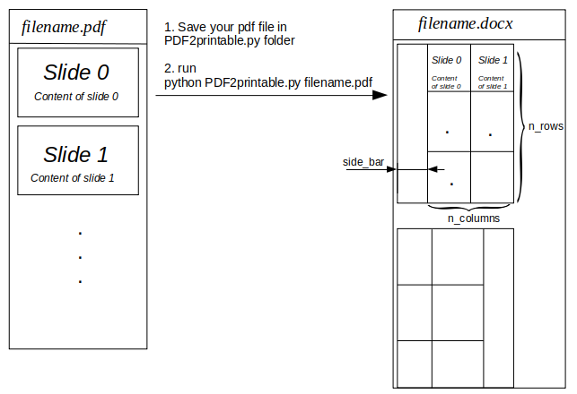

# PDF2printable
A useful python script to convert a pdf file (composed by jpg images) to a docx file with a table with all images in the pdf.

**The script is useful for students to print a pptx file made available as a pdf.**

</img>

This pdf can be saved using the chrome print toolbox with the "print as image" option.

By passing this file to the script a .docx file with all the images (the slides in the pptx) in a grid is provided.
The space is maximized to print the slides as large as possible.
A lateral space is at the left/right of the images to make the print perfect to be inserted in a notebook. 

## Usage:
- Open the pdf in the chrome pdf viewer;
- press on the *print icon*;
- under Destination set **Save as PDF**
- check **Print as image** box
- press *Save*
- save the pdf file in the folder of PDF2printable.py
- move with the teminal to the same folder and run the following code:

<code>pyhton PDF2printable.py filename.pdf </code>

The ouput of the script is _filename.docx_ file in the filename.pdf folder.

## Install
<em>Intall the libraries</em>

<code>pip install pillow PyPDF4 python-docx</code>

<em>Download the script</em>
<li><code>git clone https://github.com/AndreaMnzt/PDF2printable.git</code></li>

## Options
At the moment the only way to customize the script is edit the following lines of code:

<code>n_rows = 3</code>

<code>n_columns = 2</code>

<code>side_bar = Cm(1.5)</code>

<code>top_bar = Cm(1.5)</code>

- _n_rows_ specifies the rows of the images grid in the output docx file.
- _n_columns_ specifies the columns of the images grid in the output docx file.
- _side_bar_ specifies the width of the sidebar to make the page fit a notebook page (or to insert it in a 4-ring binder).
The value of _side_bar_ can be specified in Cm(_centimeter value_) and Inches(_inches value_). Set it to Cm(0) to remove the sidebar and make the image grid full page. 

Note 1: this is implemented as a blank column in the images table.
- _top_bar_ specifies the height of the header of the page. 

Note 1: this is implemented as a blank row in the images table.

Note 2: top_bar is currently not represented in the description image above.
### Note:
- Since the docx has a quasi fullsreen table of images, to print the document the printer should be able to print without margins.
- The script is just a (working) sketch.

### Credits
- Stackoverflow for some code snippets
